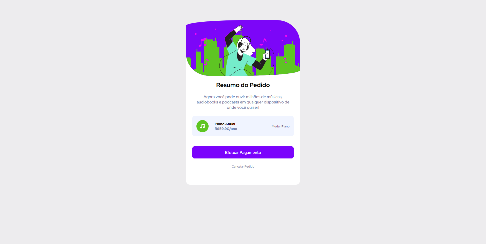

# Summary

  

## 💻 Projeto

Um projeto básico de um "Resumo de Pedido" em um site de músicas fictício, com o intuito de poder treinar minhas habilidades com HTML e CSS. Realizei algumas alterações básicas no projeto original.

Projeto retirado do site:

- [Fontend Mentor](https://www.frontendmentor.io/home)

## 🚀 Tecnologias

Esse projeto foi desenvolvido com as seguintes tecnologias:

- HTML
- CSS

Bibliotecas:

- [Google Fonts](https://fonts.google.com/)
